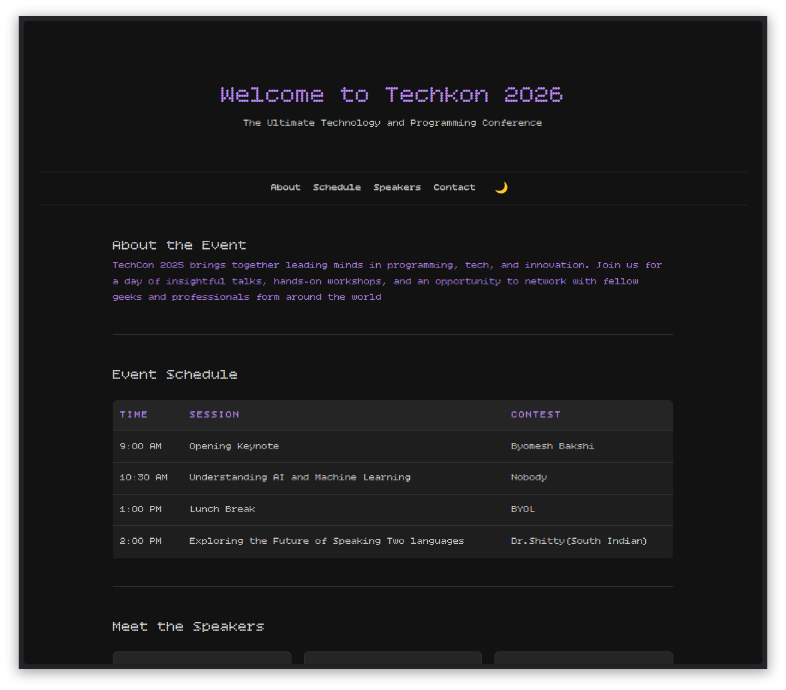
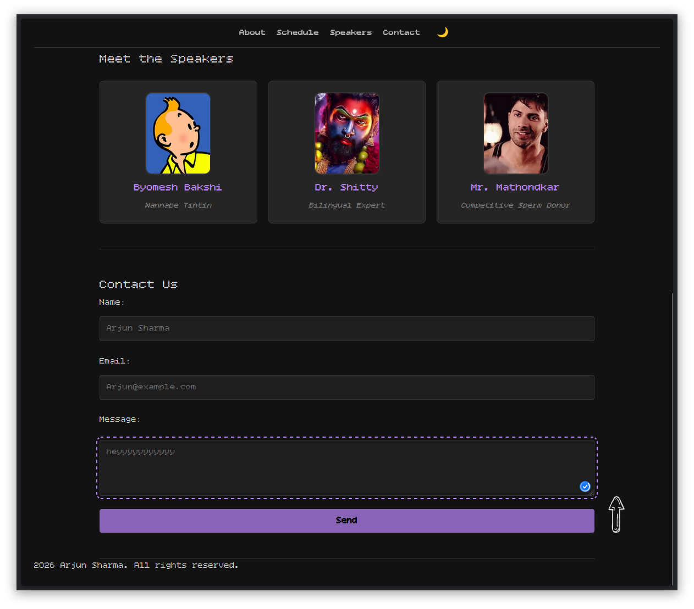
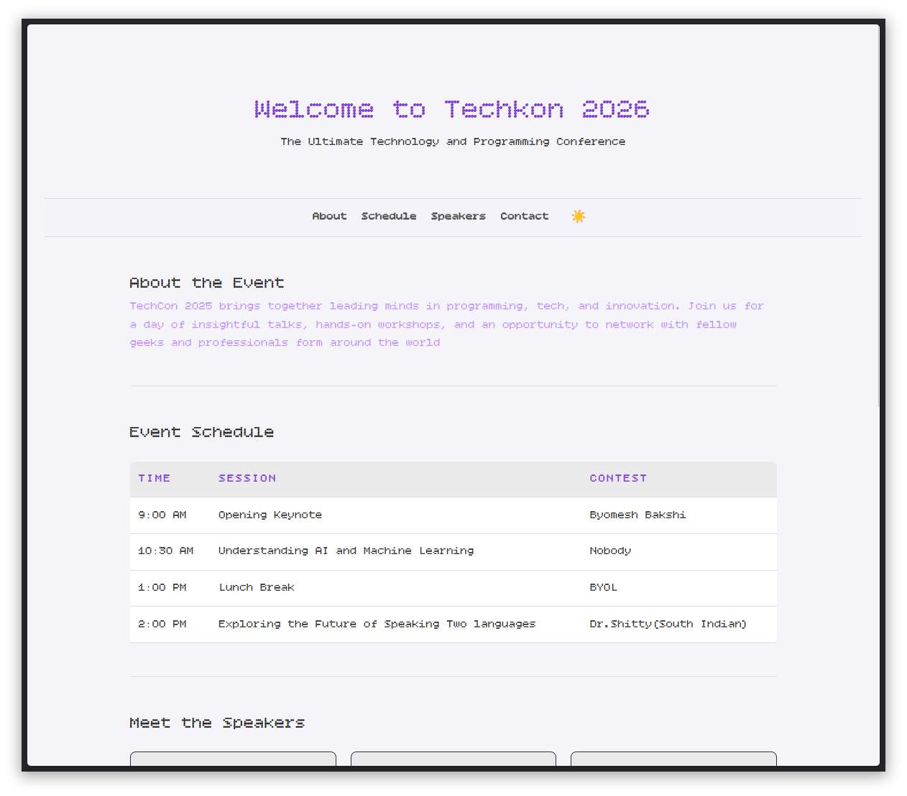
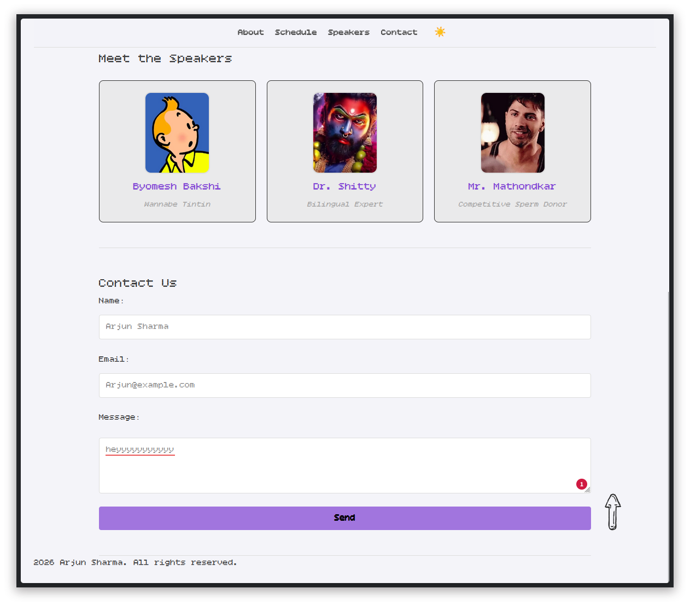

## Table of contents
- [Screenshot](#screenshot)
- [Features](#features)
- [Link](#links)
- [Build](#built-with)
- [Screenshots](#screenshots)
- [Getting-Started](#getting-started)
- [Structure](#project-structure)
- [Learning](#what-i-learned)
- [Author](#author)

# Base-test-home-page
this repo was made mainly just for learning and getting hands on experience. this event is fictional and made for fun.

Techkon 2026 - Event Webpage

A modern, responsive, and fully semantic event landing page built with HTML5, CSS3, and Vanilla JavaScript. This project was developed as part of the "Design an Event Webpage" challenge on GeeksforGeeks, with a focus on accessibility, custom branding, and a developer-centric "Dark Mode" aesthetic.

### Links

- Live Site URL: [Live](https://arjunsharma-bit.github.io/semantic-ui-lab/)

### Features

    Semantic HTML5: Built with a focus on SEO and accessibility using tags like <main>, <section>, <article>, and <time>.

    Dual Theme Support: Persistent Dark and Light modes using CSS Variables and localStorage.

    Custom Branding: Integrated hand-drawn assets (Back to Top arrow) and a custom SVG "T" logo.

    Interactive Components:

        Custom Modal: A styled "Thank You" popup for form submissions (replacing standard browser alerts).

        Smooth Navigation: CSS-based smooth scrolling for navigation links.

        Sticky Header: Frosted-glass navigation bar that stays pinned during scroll.

        Back to Top: A custom-sketched button that appears dynamically after scrolling 100px.

    Form Validation: Client-side validation for the contact form to ensure quality data entry.

### Built With

    HTML5 - Structure and semantics.

    CSS3 - Flexbox, Grid, CSS Variables, and custom animations.

    JavaScript (ES6) - DOM manipulation, Event listeners, and LocalStorage.

    Inkscape (Linux) - Vector logo design and SVG asset management.

### Screenshots
Dark Mode




Light Mode



	
### Getting Started

    Clone the repository:
    git clone https://github.com/ArjunSharma-bit/semantic-ui-lab.git

    Navigate to the project directory:
    cd techcon-2026

    Open the project:
    Simply open index.html in any modern web browser.

### Project Structure
```text
app/
├── images/                # Custom logos, sketches, and favicons
├── styles.css             # Main stylesheet with CSS Variables
├── script.js              # Theme logic, Modal, and Scroll behavior
└── index.html             # Semantic HTML structure

### What I Learned

    How to use CSS Variables to manage complex themes efficiently.

    The importance of Semantic HTML for screen readers and SEO.

    Integrating Hand-Drawn Assets into a digital interface using CSS Blend Modes.

    Handling asynchronous-style UI updates (Modals) with Vanilla JS.

### Author
Arjun Sharma 